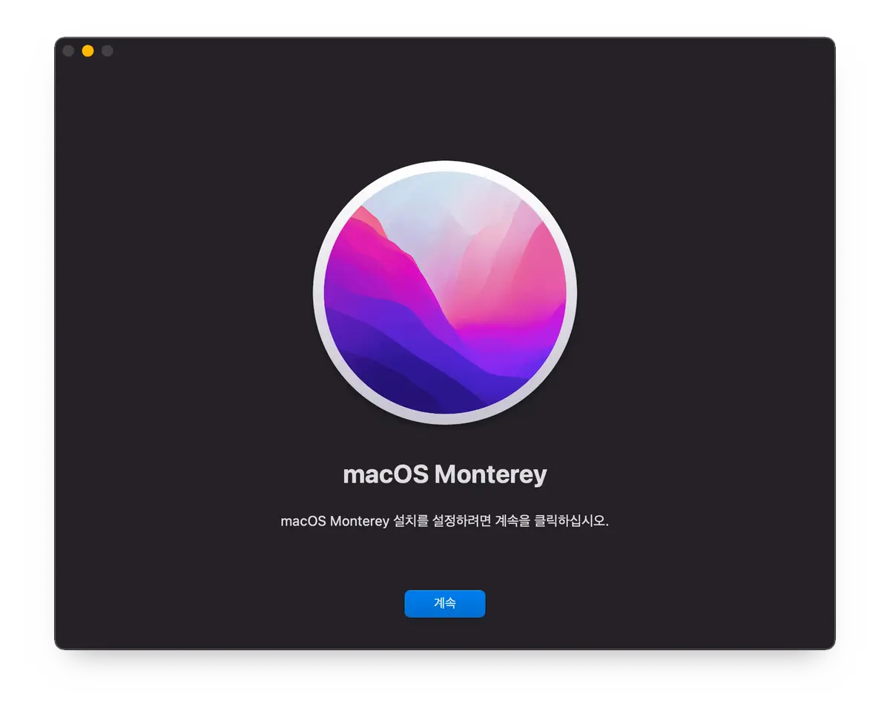
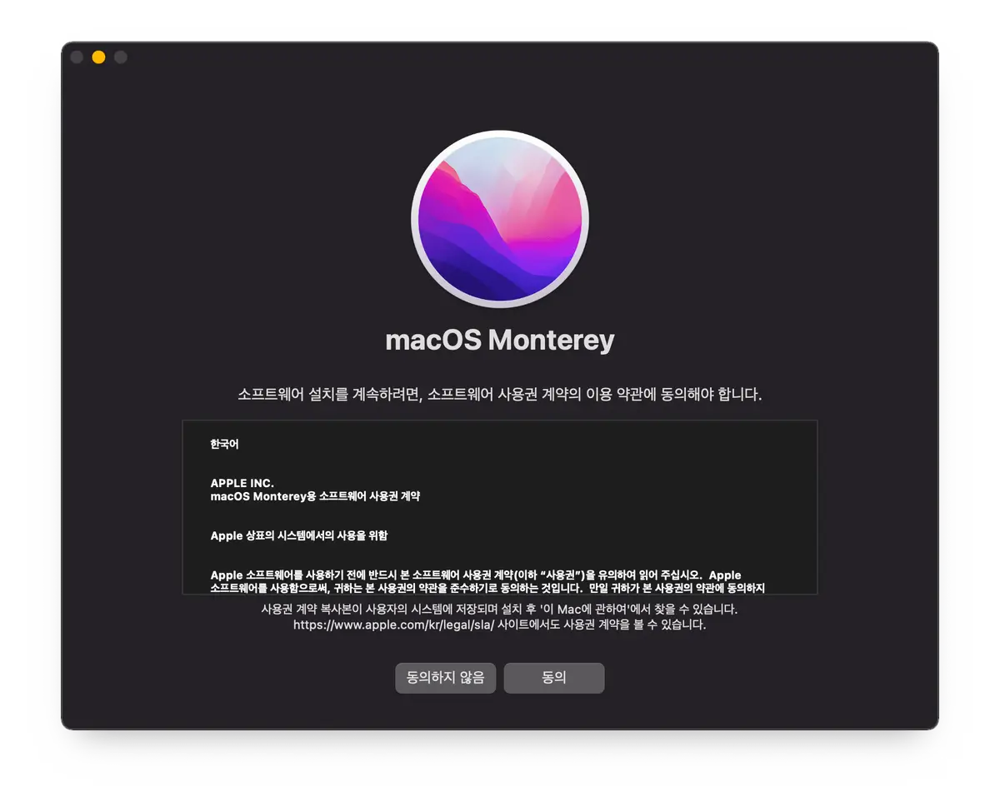
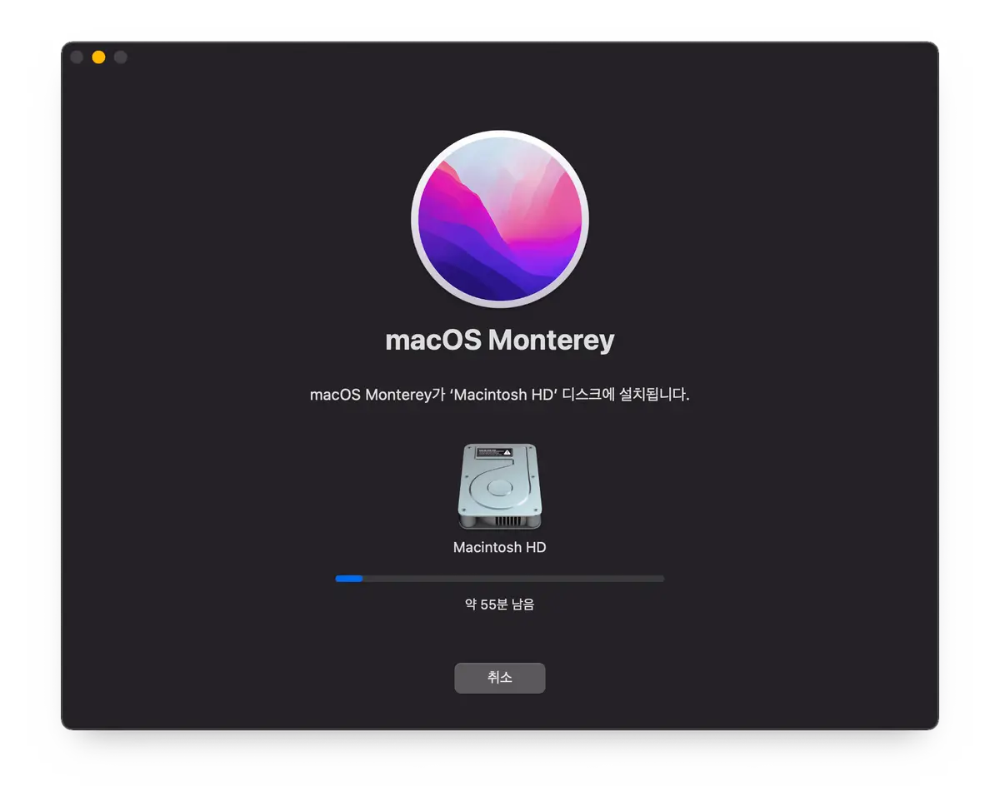
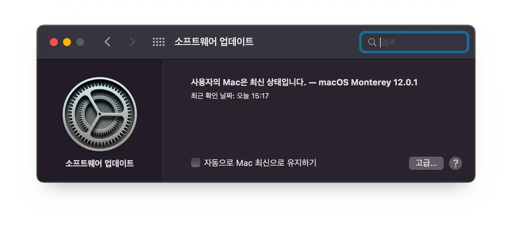
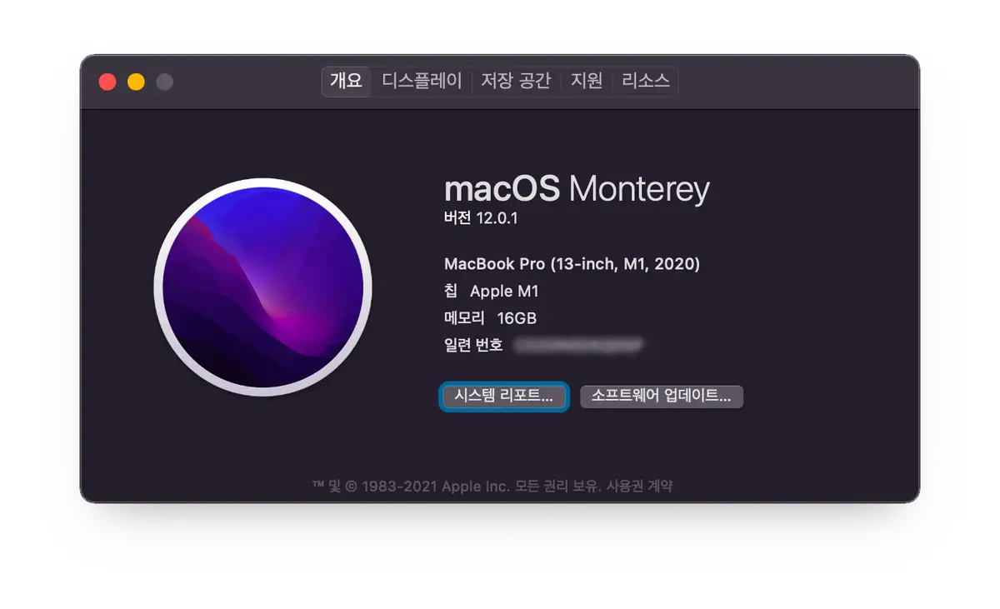
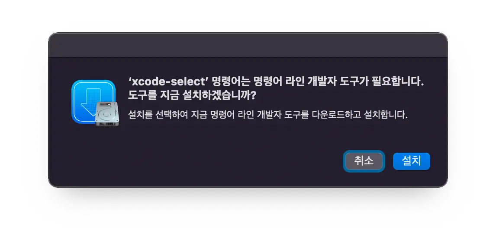

## Prologue

macOS Monterey는 Apple에서 내놓은 macOS 12버전 이름입니다.

big Sur 부터 macOS 10버전을 벗어났습니다.

Mac OS X 10.11까지만 OSX 명칭을 사용했고 macOS 10.12부터 OSX을 버리고 macOS라는 명칭을 쓰기 시작했습니다.

---

## Monterey?

몬터레이(Monterey)는 미국 캘리포니아(California)의 도시로, 인구는 27,810명입니다. (2019년 기준)

macOS 매버릭스(Mavericks)부터 애플은 애플 사옥이 있는 캘리포니아주에 있는 지명으로 이름을 짓기 시작했습니다.

## 업그레이드 하기!

환경설정에서 업그레이드가 가능합니다.



macOS Monterey Install App



macOS Monterey 사용권 계약 이용 약관 동의서


**_동의하지 않음을 동의하지 않는다_**



실제로는 30분 이내 (M1 MBP 13인치 512GB CTO 기준)

## 버전 확인 및 추가 세팅



환경설정에서 최신 버전인지 확인



'이 Mac에 관하여' 메뉴에서 버전 확인하기

이제 xcode-select를 설치해야 합니다. Big Sur에서 이미 설치를 하셨다고 하더라도 다시 설치하는 것을 추천합니다.

```shell
$ xcode-select --install
xcode-select: note: install requested for command line developer tools
```



터미널에서 xcode-select --install 명령을 하면 뜨는 화면

`설치`를 하지 않으면 여러가지 애로사항이 꽃필 수 있습니다.

---

## Epilogue


**_기다려. 아직 끝난 거 아니야._**

Homebrew로 설치한 패키지들이 제대로 동작하는지 확인해보세요.

만약 동작하지 않는 패키지가 있다면 `upgrade`를 진행하세요.

```shell
$ brew upgrade
```

인터넷이 느리거나 구형 인텔맥을 소유하고 있는 게 아닌 이상은 진행에 큰 무리는 없을 겁니다.

> 특정 버전의 패키지를 사용해야 해서 homebrew upgrade 진행하기 무서운 경우에는 잘 생각해서 upgrade를 하길 바랍니다.
