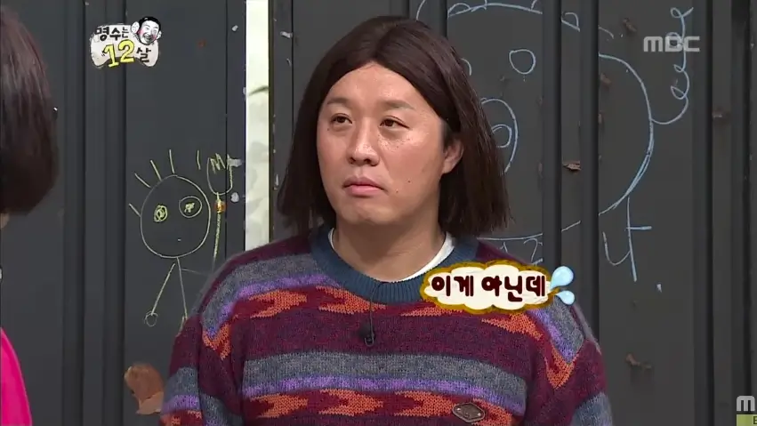

## Prologue

한글로 변수명을 지정하기, 컴포넌트명 지정하기에 이어서 이번 글에서는 디렉토리명, 이미지 파일명을 한글로 짓기에 도전해볼게요!

js 파일이나 jsx 파일명을 한글로 짓는 건 문제가 없었으니 디렉토리명과 이미지 파일명도 한글로 짓는다고 특별한 문제는 없을 거라는 추측은 미리 해볼 수 있을 듯 합니다.

시작합니다.

---

## 코드 작성

> `Next.js`로 예제를 작성했으니 염두하고 읽어주세요

```jsx
// assets/images/이미지들.jsx

const 이미지들 = {
  아이콘들: {
    홈: require('./아이콘들/홈.svg'),
    검색: require('./아이콘들/검색.svg'),
  },
}

export default 이미지들
```

```jsx
import Link from 'next/link'
import styled from '@emotion/styled'
import 이미지들 from '../assets/images/이미지들'

const 홈링크 = styled.a({
  display: 'block',
  width: '20px',
  height: '20px',
  background: `url(${이미지들.아이콘들.홈}) no-repeat 50% 50%/cover`,
})

const 검색버튼 = styled.button({
  display: 'block',
  padding: '10px',
  border: 0,
  width: '50px',
  height: '50px',
  background: `url(${이미지들.아이콘들.검색}) no-repeat 50% 50%/cover`,
})

function 홈() {
  return (
    <>
      <Link href='/'>
        <홈링크 aria-label='홈으로 이동' />
      </Link>
      <검색버튼
        type='button'
        aria-label='검색하기'
      />
    </>
  )
}

export default 홈
```

## 렌더링 결과

```html
<a aria-label="홈으로 이동" class="css-xlbdqp"></a>
<button type="button" aria-label="검색하기" class="css-1csy5ur"></button>
```

```scss
.css-1csy5ur {
  display: block;
  padding: 10px;
  border: 0;
  width: 50px;
  height: 50px;
  background: url(data:image/svg+xml;base64,PHN2zy(후략)) no-repeat 50% 50%/cover;
}
```

svg 특성상 용량이 작은 이미지이기 때문에 base64로 처리되었습니다.



**_아니 이게 아닌데????_**

파일명을 제대로 인식하는지 궁금했기 때문에 용량이 큰 png 파일로 다시 도전해봤습니다.

```scss
.css-1csy5ur {
  display: block;
  padding: 10px;
  border: 0;
  width: 50px;
  height: 50px;
  background: url(/_next/static/images/곱창-d3da0c5.png) no-repeat 50% 50%/cover;
}
```

역시나 제대로 인식합니다.


**_쳇!_**

---

## Epilogue

너무 잘 동작해서 실망입니다. (...)

다음은 한글로 뻘짓하기 마지막 글이 될 것 같아요. 이렇게 에러뜨는 경우 찾기가 힘들다니...
