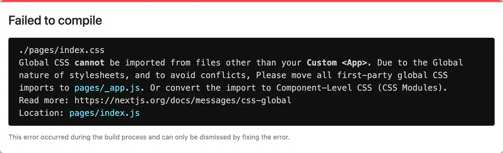

## Prologue

`youtube: https://www.youtube.com/watch?v=aEZ-CiML1pA`

**_클래스 이름이 뭐예요? (나 쉬운 클래스 아니예요)_**

> `Next.js`로 예제를 작성했으니 염두하고 읽어주세요

---

## CSS (CSS Module 말고 그냥 CSS)



**_Global CSS를 사용하라는 에러가 뜸_**

CSS Module(`.module.css`)이 아닌 CSS(`.css`)를 생성해서 사용하려고 하면 에러가 뜹니다.

`Next.js`에서는 `global.css`(또는 global.sass)를 제외한 CSS 파일은 지원하지 않기 때문에 에러가 뜨는 것입니다.

그래서 단순 CSS 파일은 한글로 작성하든, 영문으로 작성하든, 어떤 형태든 위처럼 에러가 뜨는 것을 확인할 수 있습니다.

> `global.css`를 `글로벌.css` 처럼 non-English 형태로 작성하고 `_app.js`에서 `global.css` 대신 `글로벌.css`로 임포트를 해서 사용하는 것은 아무런 문제가 없습니다.

```scss
/* styles/글로벌.css */
.헬로월드 {
  color: pink;
}
```

```jsx
<div className='헬로월드'>헬로월드</div>
```

모던 브라우저라면 utf-8 지원하기 때문에 특별한 이상없이 다음과 같이 렌더링됩니다.

```html
<div class="헬로월드">헬로월드</div>
```

지정한 컬러인 핑크로도 제대로 동작합니다.

## CSS Module

이제 우리가 궁금한 CSS Module 형태에서 Class 이름이 어떻게 적용되는지 알아보도록 해요!

CSS는 솔직히 별로 안 궁금했잖아요. (...)

```scss
.콘테이너 {
  background-color: orange;
  padding: 1em;
  width: 7rem;
  font-size: 1rem;
  color: purple;
}
```

```jsx
import styles from './index.module.css'

function 홈() {
  return (
    <div className={styles.콘테이너}>
      헬로 월드
    </div>
  )
}

export default 홈
```

> className에 하이픈(-)을 넣고 싶으면 `{styles['부모-자식']}` 이렇게 `['']` 부호로 class를 감싸면 됩니다.

결과.

```html
<div class="index_______b99_u">헬로 월드</div>
```


**_??!?_**

non-English로 이름을 지으면 언더스코어(_)로 변환이 됩니다.

클래스 뒷쪽이 랜덤으로 생성되기 때문에 렌더링은 정상적으로 되기 때문에 사용하는데는 지장은 없습니다.

`.콘테이너`에 넣어둔 Property와 Value는 정상 동작해요.

## 'import styled'를 'import 스타일드'로 변경

```jsx
import 스타일드 from '@emotion/styled'

const Container = 스타일드.main({
  fontWeight: 'bolder',
})

function Home() {
  return <Container>styled 변경 테스트</Container>
}

export default Home
```

이렇게 코드를 작성했는데 이상한 부분은 발견이 되지 않았습니다.

그래서 `Home()`을 `홈()`으로 추가로 변경했는데 이 역시 문제는 없었어요.

여기서 가상 DOM인 `Container`를 `콘테이너`로 변경해봤는데 여기서도 문제는 없었습니다.

위에서 이미 진행한 className을 한글로 지정하는 것도 추가로 진행했고 이상 없음.

마지막으로 CSS Module 파일명도 한글로 바꿨습니다.

```jsx
error - uncaughtException: TypeError: Cannot read properties of undefined (reading 'updateHash')
```

그러자 위 같은 에러가 뜹니다.

`styled`를 `스타일드`로 바꾸거나 CSS Module 파일명을 한글로 바꾸거나 둘 중 하나만 했을 때는 에러가 없었는데 둘 다 한글로 바꾸니 에러가 떴습니다.

이렇게 변태적으로 코딩하는 경우가 없어서 그런지 아무리 구글과 스택오버플로우 사이트를 뒤져도 해결하는 방법이 나오진 않았습니다.


**_...드디어 찾.았.다._**

---

## Epilogue

한가지 주의할 점은 git 관리시 파일명 인코딩이 깨질 수 있으니 터미널에서 다음 명령어를 내려줄 필요가 있습니다. (물론 이렇게 코딩할 사람은 없을 거라고 생각하지만...)

```shell
$ git config --global core.quotepath false
```

그리고 macOS, Linux, Windows는 각각 파일명 및 디렉토리명 인코딩 처리 방법이 다르므로 여러 협업자가 서로 다른 운영체제에서 개발 중이라면 파일명 관련해서 어떤 이슈가 발생할지 장담할 수 없습니다.

파일명과 디렉토리명 만큼은 OS를 통일하던가, 영문으로만 관리하던가 둘 중 하나를 택하길 바라요.

한글로 뻘짓하기는 여기서 마무리하고 다음에는 다양한 non-English 글자들로 테스트 해보겠습니다!
