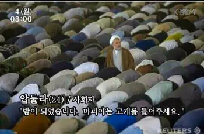

import { v4 as uuidv4 } from 'uuid';
import YouTubeVideo from '../components/utilities/youTube';
import LinkButton from '../components/utilities/linkButton';
import "@deckdeckgo/highlight-code";
import { defineCustomElements as deckDeckGoHighlightElement } from "@deckdeckgo/highlight-code/dist/loader";
deckDeckGoHighlightElement();

## Prologue

이번 글에서는 시리아, 아랍, 히브리 등 오른쪽에서 왼쪽으로 쓰는 **아랍 문자(الأَبْجَدِيَّة العَرَبِيَّة al-abjadīyah al-ʻarabīyah, 알 압자디얄 아라비야)**로 React 개발 찍먹을 해보도록 하겠습니다.

테스트 하면서 깨달은건데 이름 같은 것만 아랍 문자로 쓰는 건데도 순서가 달라져서 좀 힘들더군요.


**_(...)_**

> `Next.js`로 예제를 작성했으니 염두하고 읽어주세요

---

## مسكن.module.sass

```sass
.מְכוֹלָה
  background-color: orange
  padding: 1em
  width: 7rem

  .כּוֹתֶרֶת
    font-size: .75rem
    color: blue

.محتويات
  font-size: 1rem
  color: purple
```

## index.js

```jsx
import styled from '@emotion/styled'
import الأنماط from './مسكن.module.sass'

const מְכוֹלָה = styled.div({
  fontWeight: 'bolder',
})

function مسكن() {
  return (
    <מְכוֹלָה className={الأنماط.מְכוֹלָה}>
      <h1 className={الأنماط.כּוֹתֶרֶת}>שלום עולם!</h1>
      <p className={الأنماط.محتويات}>مترجم جوجل هي الأفضل.</p>
    </מְכוֹלָה>
  )
}

export default مسكن
```

## Result

```html
<div class="_______________3BbsL css-q0k6az">
  <h1 class="________________e_jSQ">שלום עולם!</h1>
  <p class="______________TjJxq">مترجم جوجل هي الأفضل.</p>
</div>
```

이전 글을 읽었던 분들이라면 결말 모두 유추하셨죠?



**_열린 결말_**

---

## Epilogue

*이 글을 중동 사람들이 볼까?*
