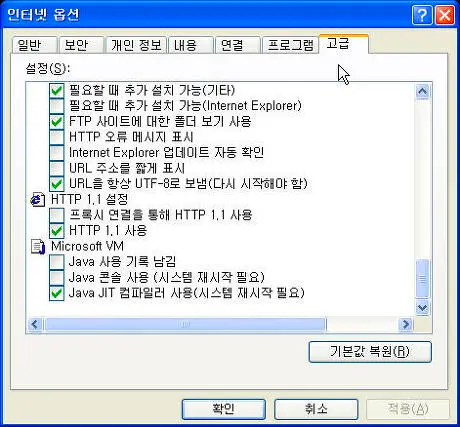

## Prologue

Vanilla 환경에서 한글로 클래스명 짓기, JavaScript 변수명 짓기, Element 생성하기를 해보고 싶었습니다. 과연 잘 될까요?

> 어떠한 영향도 받는 상황이 연출되지 않게 Live Server 조차도 사용하지 않은 상태에서 테스트가 진행되었습니다.

- - -

## CSS & HTML

```scss
// index.css
.콘테이너 {
  font-size: 1.2rem;
  font-weight: bolder;  
}
```

```html
<!DOCTYPE html>
<html lang="ko-KR">

<head>
  <meta charset="utf-8" />
  <meta name="viewport" content="width=device-width" />
  <link rel="stylesheet" href="./index.css" type="text/css" media="all" />
</head>

<body>
  <div class="콘테이너">
    헬로 월드
  </div>
</body>

</html>
```

아무 문제없이 렌더링이 이루어졌습니다.

React에서는 JavaScript로 그리기 때문에 클래스명이 다른 이름으로 변경이 되지만 여기서는 Vanilla 환경이기 때문에 어떠한 영향도 주지 않았습니다.

> class 이름은 첫 문자에 숫자 및 특수문자가 오면 안된다는 룰이 있습니다. 특수문자 중에서 사용 가능한 문자는 하이픈, 언더스코어 둘 뿐입니다.
>
> 다만, 숫자는 앞 문자로만 사용이 불가능하고 앞을 제외한 어떤 곳에서든 사용이 가능합니다.
>
> id 이름 역시 class와 동일한 네이밍 룰을 가지고 있으며, id는 한 화면에 동일 이름으로 여러번 사용이 불가합니다. (unique selector)
>
> html에서의 id는 개발에서 사용하는 id처럼 index 역할도 하는데 이것을 생각해보면 한 페이지당 동일 이름 사용 불가하다는 게 왜 그런지 이해하실 수 있을거라 생각해요.

## JavaScript

```javascript
const 버튼 = document.createElement('button');
const 레이블 = document.createTextNode('눌러눌러');
버튼.appendChild(레이블);
document.body.appendChild(버튼);
```

위와 같이 작성하면

```html
<button>눌러눌러</button>
```

이렇게 제대로 렌더링됩니다.

물론 소스보기 했을 때는 JavaScript 코드 형태로만 보실 수 있습니다. 이게 싫으면 `Next.js`처럼 `SSR` 지원하는 프레임워크를 사용하세요.

```javascript
const 버튼_컴포넌트 = document.createElement('버튼');
const 레이블_컴포넌트 = document.createTextNode('눌러눌러');
버튼_컴포넌트.appendChild(레이블_컴포넌트);
버튼_컴포넌트.setAttribute('type', 'button')
document.body.appendChild(버튼_컴포넌트);
```

Element(태그)도 한글로 추가해보았는데 제대로 동작했습니다.

```html
<버튼 type="button">눌러눌러</버튼>
```


***잘 되는 걸 나만 몰랐구나... 그렇구나...***

## 라스트팡! 파일명 테스트

마지막으로 파일명을 바꿔도 동작하는지 테스트 해보겠습니다.

Sass 경우에 자동으로 CSS 파일로 컴파일하는 과정이 있는데 이때 CSS 파일이 자동 생성되게 됩니다. 그래서 파일명 변경은 Sass에서 작업하면 CSS 파일도 정상적으로 인식하는지 자동으로 테스트가 가능할 겁니다.

여기서는 이미지 파일도 추가로 테스트 합니다. 테스트로 사용할 이미지는 이전에 사용한 적이 있는 곱창 이미지를 사용할 겁니다.


***츄릅! 츄릅!***

위 이미지는 실제로 한글로 이루어진 파일명을 사용하고 있습니다. `곱창.jpeg`

> `dev1stud.io`에서는 이미지 최적화 차원에서 `.webp`와 `.jpeg`(.jpg)를 세트로 사용하고 있습니다.
>
> (썸네일에서는 `.webp`, `.png`를 세트로 사용)

```sass
// 인덱스.sass

.콘테이너
  font-size: 1.2rem
  font-weight: bolder

  .이미지
    width: 200px
    height: 200px
    background: url('./곱창.jpg') no-repeat 50% 50%/contain
```

```html
<!DOCTYPE html>
<html lang="ko-KR">

<head>
  <meta charset="utf-8" />
  <meta name="viewport" content="width=device-width" />
  <link rel="stylesheet" href="./인덱스.css" type="text/css" media="all" />
</head>

<body>
  <div class="콘테이너">
    헬로 월드
    <div class="이미지"></div>
    
  </div>
  <script>
    const 버튼 = document.createElement('button');
    const 레이블 = document.createTextNode('눌러눌러');
    버튼.appendChild(레이블);
    document.body.appendChild(버튼);
  </script>
</body>

</html>
```

결과는 성공!


***호우!***

- - -

## Epilogue



***고전짤***

- - -

**2023년 11월 6일 추가사항 : Netlify CMS에서는 이미지명을 한글로 작성하면 git에서 제대로 머징이 안 될 수 있습니다.**