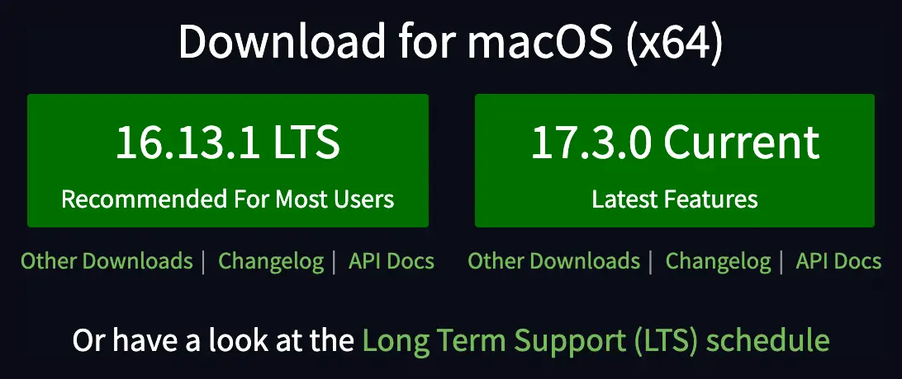

## Prologue

Angular, React, Svelte, 그리고 Vue를 macOS에서 시작해 봅시다!

---

## 공통 설치과정

4개의 프레임워크는 `JavaScript` 또는 `TypeScript` 기반이기 때문에 `Node.js`가 필요합니다.

[Node.js 공식 웹사이트](https://nodejs.org/en)



**_LTS를 선택하세요_**

글 작성 날짜 기준으로 LTS 버전은 16.13.1 입니다.

버전을 맞출 필요 없으니 가장 최신의 LTS 버전으로 설치해 주세요. 다만 취미 또는 테스트 용도로 사용할 생각이라면 Current 버전 설치도 상관 없습니다.

설치 및 세팅시 root가 아닌 user local로 경로를 설정해서 사용하는 것을 추천합니다. 이렇게 세팅하면 npm, yarn 패키지 설치시 root 권한이 아닌 user 권한으로 설치가 가능합니다.

```shell
## root에 설치시 sudo 필요
$ sudo npm i -g vue

## user에 설치시 sudo 필요없음
$ npm i -g vue

```

Homebrew 사용해서 설치하지 마세요. 추천하지 않습니다.

## Angular

> UPDATE: Angular.js(1.x)는 Google에서 더 이상 지원하지 않으므로 설치 방법을 따로 언급하지 않습니다.

angluar-cli 패키지를 설치합니다. cli를 이용하면 프로젝트 생성과 세팅이 자동으로 이루어집니다.

```shell
$ npm i -g @angular/cli
$ ng new project-name
```

개발 서버 실행은 ng 명령어를 쓸 수도 있고 npm 명령어를 쓸 수도 있습니다.


```shell
$ ng serve

## 또는

$ npm start
```

## React (CRA)

> ReactJS(React), Next.js 그리고 React Native(RN)의 설치 방법을 안내합니다

```shell
$ npx create-react-app project-name
$ cd project-name
$ npm start
```


**_심플 이즈 베스트 (출처: ㅍㅍㅅㅅ)_**

## Next.js (CNA)

React 프로젝트 없이 Next.js로 처음부터 프로젝트를 시작하려면 다음과 같이 입력합니다.

```shell
## npx
$ npx create-next-app

## yarn
$ yarn create next-app
```

React 프로젝트 위에 Next.js를 추가로 얹고 싶다면 다소 복잡하지만 다음과 같이 몇가지 패키지와 `package.json`을 편집하세요.

```shell
$ npm i next

## react-dom 설치가 안되어 있을 때는 react-dom 추가 설치 필요
$ npm i react-dom

## next, react-dom 같이 설치
$ npm i next react-dom
```

```json
// package.json
"scripts": {
  "dev": "next dev",
  "build": "next build",
  "start": "next start",
  "lint": "next lint"
}
```

기존에는 `package.json`의 `scripts`에 react가 언급되어 있는데 위와같이 next로 변경하세요.

`package.json` 파일은 브라우저를 refresh 한다고 해서 적용이 되는 게 아니기 때문에 만약 개발서버가 동작하고 있다면 `ctrl` + `c`를 눌러서 닫아주세요.

## React Native

Expo 환경이냐, Metro 환경이냐에 따라서 세팅이 다르며, 실행 방법도 다릅니다.

그리고 Android는 Java 환경이므로 Adroid Studio 외에도 설치 및 세팅해야 할 게 많습니다.

iPad, iOS는 Xcode 외에도 CocoaPod를 설치해야 하는 과정이 있습니다. (인텔맥, 애플 실리콘 여부에 따라서도 세팅이 달라짐)

[공식문서를](https://reactnative.dev/docs/environment-setup) 확인하세요

## Svelte

Svelte는 degit이라고 하는 bundler를 이용해 프로젝트를 생성합니다.

```shell
$ npx degit sveltejs/template project-name
$ cd project-name
$ npm i
$ npm run dev
```

참고로 degit은 github repository를 이용해 템플릿을 설치하는 bundler라고 생각하면 됩니다.

`sveltejs templete`에 대한 내용은 [여기를](https://github.com/sveltejs/template) 참조하세요.

## SvelteKit

SvelteKit은 React의 Next.js, Vue.js의 Nuxt.js와 같이 여러가지 키트를 지원해주는 Svelte용 framework 입니다.

Svelte와 다르게 SvelteKit은 npm init으로 프로젝트를 생성합니다.

```shell
$ npm init svelte@next project-name
$ cd project-name
$ npm i
$ npm run dev
```

> 글 쓰는 시점에서는 SvelteKit은 베타 버전입니다. 불안정할 수 있습니다.

## Vue

vue 패키지와 vue cli 패키지를 설치해야 합니다.

```shell
$ npm i -g vue
$ npm i -g @vue/cli
```

vue는 프로젝트 생성시 몇 가지 템플릿을 골라서 생성할 수 있습니다.

템플릿 종류로는 browserify, browserify-simple, simple, webpack, webpack-simple 이렇게 있습니다.

크게 browserify를 사용해 live server를 돌릴지, webpack을 사용해 live server를 돌릴지, 아니면 서버 구동없이 돌릴지 (simple) 3가지 방법으로 나눌 수 있고, browserify와 webpack에 붙은 -simple 여부는 테스트 코드를 작성할지 안할지를 고르는 거라고 생각하면 됩니다. (-simple이 테스트 코드 작성 안하는 템플릿)

```shell
## simple 템플릿 선택시
$ vue init simple project-name
```

live server 세팅시 webpack이 가장 문서가 많으므로 템플릿은 `webpack`을 추천합니다.

## Nuxt

Nuxt는 Next.js의 Vue 버전이라고 한다면 이해하기 쉽습니다. SSR 방식으로 렌더링합니다.

설치 방법은 React와 마찬가지로 Vue 프로젝트를 진행하고 있는 도중에 Nuxt 설치하기, 그리고 새 프로젝트로 처음부터 Nuxt로 설치하기 2가지로 나눌 수 있습니다.

새로 프로젝트를 시작할 때는 npm 또는 npx을 사용하면 됩니다. (모든 과정은 yarn도 지원합니다)

```shell
## npx
$ npx create-nuxt-app project-name

## npm
$ npm init nuxt-app project-name

## yarn
$ yarn create nuxt-app project-name
```

이미 진행 중인 Vue 프로젝트에 Nuxt를 설치하기 위해서는 몇 가지를 수정하거나 추가/설치 해야 합니다.

```shell
$ npm i nuxt
```

```json
// package.json
"scripts": {
  "dev": "nuxt",
  "build": "nuxt build",
  "generate": "nuxt generate",
  "start": "nuxt start
}
```

---

## Epilogue

이번 글에서는 각 프레임워크를 맥OS에서 시작하는 방법에 대해 알아보았습니다.

다음 글에서는 실제로 개발하는 방법을 간단히 알아볼게요. *(실제로 간단할지는...)*
