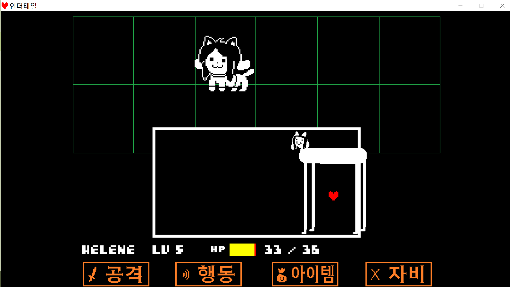

## Prologue

Angular, React, Svelte, 그리고 Vue로는 어떻게 개발할까요? CSS 작업은요?

4가지 프레임워크 모두를 __찍먹__하기 위해서는 일단 __집중력__이 필요합니다. 글이 약간 긴 관계로 집중 __빡!__ 해주세요

---

## 변수없이 '헬로 월드' 보여주기

개발의 기본이죠. `헬로 월드`를 화면에 뿌려보기.

```html
<!-- HTML -->
<head>
  <title>헬로 월드</title>
</head>
<body>
  <main><p>헬로 월드</p></main>
</body>
```

```jsx
// React with Next.js
function Home() {
  return (
    <main>
      <Head>
        <title>헬로 월드</title>
      </Head>
      <p>헬로 월드</p>
    </main>
  )
}
```

```html
<!-- Svelte -->
<svelte:head>
  <title>헬로 월드</title>
</svelte:head>

<svelte:body>
  <main><p>헬로 월드</p></main>
</svelte:body>
```

```html
<!-- Vue with Nuxt -->
<template>
  <main><p>헬로 월드</p></main>
</template>

<script>
  export default {
    head: () => ({
      title: '헬로 월드',
    }),
  }
</script>
```

## 변수로 지정한 '헬로 월드' 보여주기

Angular와 Vue는 변수를 불러올 때 `{{...}}` 처럼 괄호를 2번 써야하고 React와 Svelte는 `{...}` 처럼 괄호를 1번만 사용합니다.

If, Angular

```typescript
// app/app.component.ts
import { Component } from '@angular/core';

@Component({
  selector: 'app-hello',
  templateUrl: 'src/app/app.component.html'
})
export class AppComponent {
  constructor() {}

  world: string = '월드';
}
```

```html
<!-- app/app.component.html -->
<div>
  <p>헬로 {{ world }}</p>
</div>
```

If, React

```jsx
function AppHello() {
  const world = '월드'
  return (
    <div>
      <p>헬로 { world }</p>
    </div>
  )
}

export default AppHello
```

If, Svelte

```html
<script>
  const world = '월드';
</script>

<div>
  <p>헬로 { world }</p>
</div>
```

If. Vue

```html
<div id="app-hello">
  <p>헬로 {{ world }}</p>
</div>

<script>
  var appHello = new Vue({
    el: '#app-hello',
    data: {
      world: '훨드'
    }
  })
</script>
```

## 컴포넌트 작성하기

Angular는 TypeScript를 사용하여 작성해야 합니다.

> Component를 불러오는 파일은 html 형식이고, Component만 `.ts` 입니다.

```html
<!-- index.html -->
<head>
  <title>헬로 월드</title>
</head>

<body>
  <app-root></app-root>
</body>
```

```html
<!-- app/app.component.html -->
<main><p>헬로 월드</p></main>
```

```typescript
// app/app.components.ts
import { Component } from "@angular/core";

@Component({
  selector: "app-root",
  templateUrl: "./app.component.html"
})
export class RootComponent {
  title = "헬로 월드";
}
```

React는 하나의 파일에 넣을 수도, component를 따로 분리할 수도 있습니다.

```jsx
import Bibimbap from './bibimbap'

const Gopchang = <p>곱창 먹고싶다</p>

function Home() {
  return (
    <>
      <h1>배고픈 O612</h1>
      <Gopchang />
      <Bibimbap />
    </>
  )
}

export default Home
```

```jsx
// bibimbap.js
function Bibimbap() {
  return <p>비빔밥도 먹고싶다</p>
}

export default Bibimbap
```

Svelte는 React와 비슷합니다.

```html
<script>
  import Bibimbap from './bibimbap.svelte';
  const Gopchang = <p>곱창 먹고싶다</p>
</script>

<Gopchang></Gopchang>
<Bibimbap></Bibimbap>
```

```html
<!-- bibimbap.svelte -->
<p>비빔밥도 먹고싶다</p>
```

> React는 component, fragment의 chidren에 string, text 등이 없을 때 html의 short tag처럼 짧게 쓸 수 있고 Svelte는 짧게 쓸 수 없습니다.
> 
> 예제로 보여드린 React와 Svelte에서 사용한 `Gopchang`과 `Bibimbap` 코드를 참고하세요.

Vue는 component 안에 html은 `template`를 사용해야 합니다.

```html
<div id="app">
  <p>곱창 먹고싶다</p>
  <bibimbap />
</div>
<script type="text/javascript">
  var bibimbap = Vue.component("bibimbap", {
    template: `<p>비빔밥도 먹고싶다</p>`,
  });

  var app = new Vue({
    el: "#app",
    data: {
      message: "헬로 월드! index.html"
    }
  });
</script>
```

## 버튼을 누르면 카운트 올라가는 예제 만들어보기

If, Angular

```typescript
// app/app.component.ts
import { Component } from "@angular/core";

@Component({
  selector: "app-root",
  templateUrl: "./app.component.html",
})
export class AppComponent {
  count: number = 1;

  handleClick() {
    this.count++;
  }
}
```

```html
<!-- app/app.component.html -->
<button (click)="handleClick()">
  Clicked {{ count }} {{ count === 1 ? 'time' : 'times' }}
</button>
```

If, React

```jsx
import { useState } from 'react'

// function App() {
const App = () => {
  const [count, setCount] = useState(1);

  const handleClick = () => {
    setCount(count + 1)
  }

  return (
    <button onClick={handleClick}>
      Clicked {count} {count === 1 ? 'time' : 'times'
    </button>
  )
};

export default App
```

If, Svelte

```html
<script>
  const count = 1;

  function handleClick() {
    count += 1;
  }
</script>

<button on:click={handleClick}>
  Clicked {count} {count === 1 ? 'time' : 'times'}
</button>
```

If, Vue

```html
<template>
  <button @click="handleClick">
    Clicked {{ count }} {{ count === 1 ? 'time' : 'times' }}
  </button>
</template>

<script>
  export default {
    data() {
      return {
        count: 1;
      };
    },
    methods: {
      handleClick() {
        this.count += 1;
      }
    }
  };
</script>
```

실행시 브라우저에서는 다음과 같이 코드가 생성됩니다.

```html
<button>Clicked 1 time</button>
```

버튼을 누르면 숫자가 바뀌고 `time`이 `times`로 바뀝니다.

```html
<button>Clicked 2 times</button>
```



**_스크롤의 압박_**

---

## Epilogue

이번 글은 이전에 포스타입에 올렸던 내용들을 하나로 합하고 필요없는 내용은 빼고 있어야 하는 내용이 빠진 경우에는 추가해서 취합한 내용입니다.

그래서 스크롤이 다소 길어졌습니다. *(대국민 사과)*

다음 글에서는 이 프레임워크들을 이용해 스타일링 및 CSS 작성하는 방법에 대해 써볼게요. 안녕~!


**_(어떻게 알았지?)_**