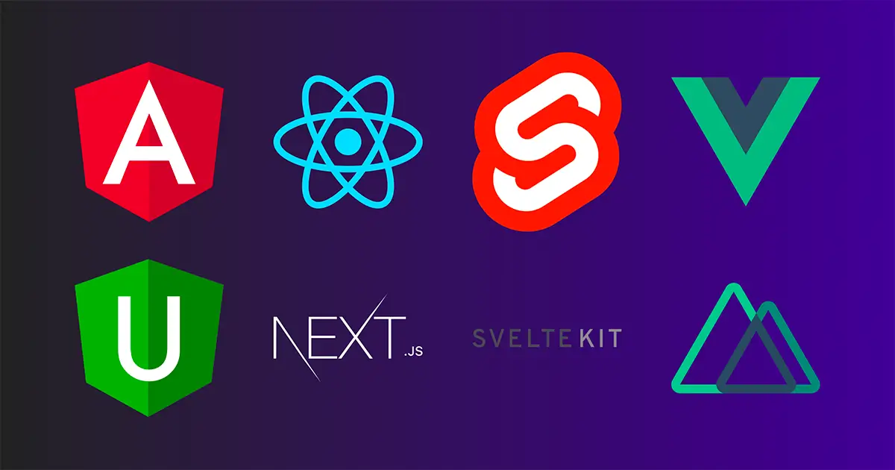

## Prologue

CSR 방식으로 동작하는 Angular, React, 그리고 Vue는 여기에 언급한 Angular Universal, Next.js 그리고 Nuxt를 사용하면 SSR 방식으로 사용할 수 있습니다.

참고로 Svelte는 SvelteKit과 별개로 SSR 방식으로 동작합니다.

> React를 베이스로 만들어진 것 중에 Gatsby라고 하는 프레임워크도 있는데 Gatsby는 CSR, SSR 둘 다 아닙니다.
> 
> 빌드를 하면 코드가 html 파일처럼 생성되는데 Next.js와 다르게 component도 특별한 서버 없이 동작합니다.
> 
> 이와 같은 형태를 SSG라고 합니다. (이 블로그가 Gatsby로 만들어졌습니다.)



**_스티커 구해서 맥북에 붙이고 싶다._**

---

## 프로젝트 생성 및 실행하기

If, Angular Universal

```shell
# Angular CLI
ng new project-name
cd project-name
ng add @nguniversal/express-engine --clientProject project-name
ng add @nguniversal/aspnetcore-engine --clientProject project-name
ng add @nguniversal/hapi-engine --clientProject project-name
ng add @nguniversal/socket-engine --clientProject project-name
```

If, Next.js

```shell
# Yarn
yarn create next-app
cd project-name
yarn dev

# npx, npm
npx create-next-app
cd project-name
npm run dev
```

If, SvelteKit

```shell
# Yarn
yarn create svelte@next project-name
cd project-name
yarn add
yarn dev

# npm
npm init svelte@next project-name
cd project-name
npm i
npm run dev
```

If, Nuxt

```shell
# Yarn
yarn create nuxt-app project-name
cd project-name
yarn dev

# npm
npm init nuxt-app project-name
cd project-name
npm run dev
```

## 디렉토리(폴더) 구조 보기

> 부득이하게 `Angular Universal`는 생략했습니다.

If, Next.js

```shell
├── README.md
├── next.config.js
├── package-lock.json
├── package.json
├── pages
│　 ├── _app.js
│　 ├── api
│　 │　 └── hello.js
│　 └── index.js
├── public
│　 ├── favicon.ico
│　 └── vercel.svg
└── styles
    ├── Home.module.css
    └── globals.css
```

image를 object로 관리할 때는 `/assets`를 만들어서 관리하고, components는 `/components`를 만들어서 관리합니다.

JavaScript의 `document`, `window`는 쓸 수 없습니다. 다만 SSR이 아닌 CSR로 컴포넌트를 불러올 수 있기 때문이 이를 사용하면 사용이 가능합니다.

React에서는 `<head>`를 관리하려면 `React-Helmet`이라든가 하는 패키지를 사용해야하지만 Next.js에서는 자체 내장되어 있는 `next/head`를 사용하면 쉽게 구현이 가능합니다.

React와 다르게 html ~ head, body 관리를 하기 위해서는 `/pages/_document.js`를 사용합니다.

If, SvelteKit

```shell
├── README.md
├── jsconfig.json
├── package.json
├── playwright.config.js
├── src
│　 ├── app.css
│　 ├── app.html
│　 ├── hooks.js
│　 ├── lib
│　 │　 ├── Counter.svelte
│　 │　 ├── form.js
│　 │　 └── header
│　 │　     ├── Header.svelte
│　 │　     └── svelte-logo.svg
│　 └── routes
│　     ├── __layout.svelte
│　     ├── about.svelte
│　     ├── index.svelte
│　     └── todos
│　         ├── _api.js
│　         ├── index.js
│　         └── index.svelte
├── static
│　 ├── favicon.png
│　 ├── robots.txt
│　 ├── svelte-welcome.png
│　 └── svelte-welcome.webp
├── svelte.config.js
└── tests
    └── test.js
```

패키지가 설치가 된 상태가 아니기 때문에 `yarn add` 또는 `npm i` 실행해야 합니다.

body 태그 안의 기본 구조는 /src/app.html 에서 관장합니다. 전체 구조를 body에서 각각의 페이지에서 개별 작동하게 코드를 쓸 수 있습니다. `%svelte.head%`, `%svelte.body%`

`%svelte.assets%`를 이용해서 절대경로(http 또는 https 프로토콜 포함한 경로)로 이미지를 불러올 수 있습니다. (주로 link 태그나 meta 태그에 사용)

Svelte는 컴포넌트 Component 대신 라이브러리 Library (`/src/lib` 디렉토리) 라고 부릅니다.

JavaScript로만 이루어진 라이브러리는 기존대로 `.js` 확장자를 씁니다.

If, Nuxt

```shell
├── README.md
├── components
│　 ├── NuxtLogo.vue
│　 └── Tutorial.vue
├── jest.config.js
├── nuxt.config.js
├── package-lock.json
├── package.json
├── pages
│　 └── index.vue
├── static
│　 └── favicon.ico
├── store
│　 └── README.md
└── test
    └── NuxtLogo.spec.js
```

컴포넌트 기본 확장자가 `.vue`인 것을 확인할 수 있어요.

body 태그 안의 기본 구조는 `/nuxt.config.js`에 정의되어 있습니다.

페이지 단위로 작성은 `/pages`에 넣으면 되고 컴포넌트 단위 작성은 `/components`에 넣으면 됩니다.

컴포넌트를 불러오는 것은 import를 따로 할 필요없이 태그 형태로 작성하면 불러옵니다.

```html
<template>
  <Tutorial/>
</template>
```

위와같이 코드를 작성하면 `/components/Tutorial.vue`를 불러옵니다.

---

## Epilogue

각 베이스 프레임워크에 대해서 간단히 설치법과 사용법을 안내해 드렸습니다.

개발에 대해 아주 백지인 상태가 아니라면 이해하는데 지장은 없었을 거라고 생각해요.

그럼 다음에 또 만나요! 다음 글 __관많부!!!__


**_자바스트립..._**